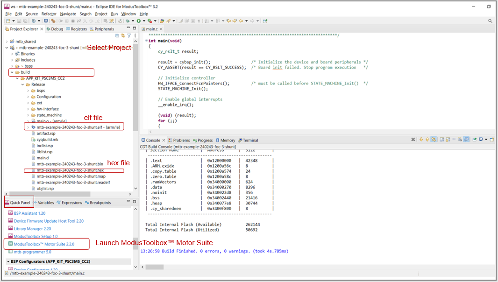
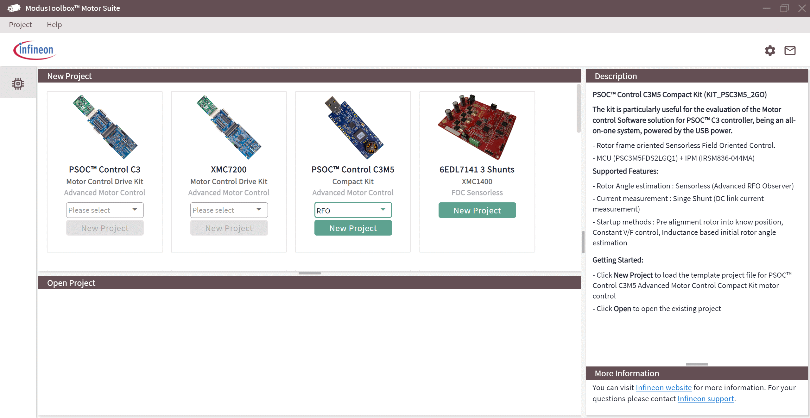
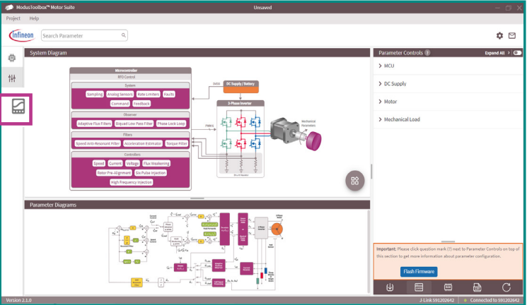
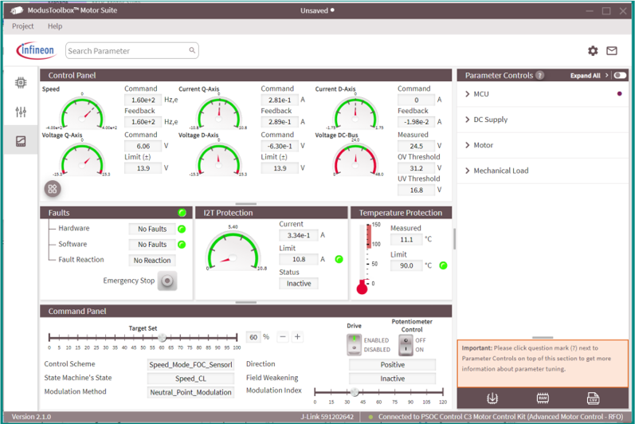
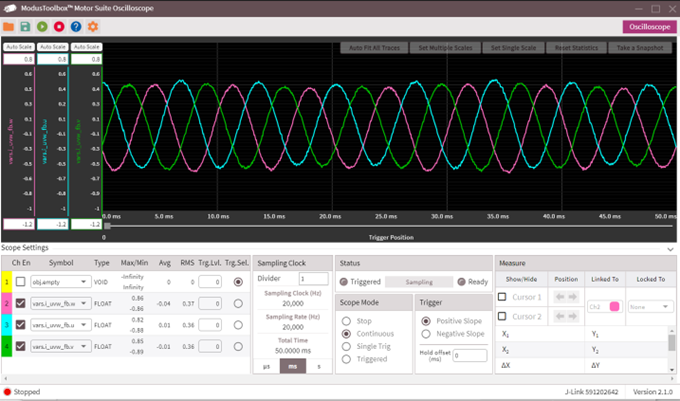
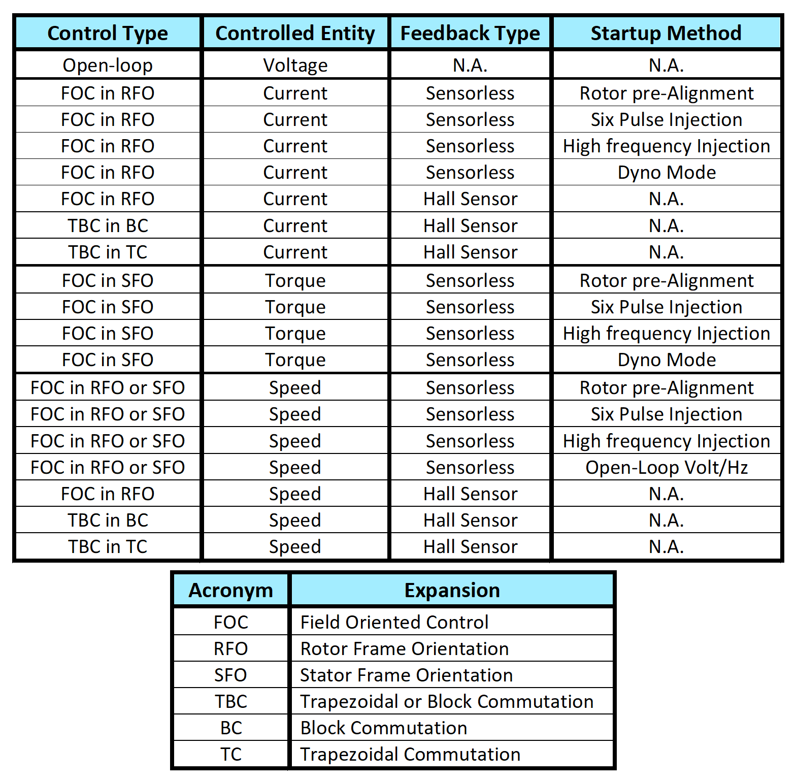

# Motor control demo - RAK-GaN_rev0


This code example demonstrates the sensorless and sensored solutions using the Infineon's PSOC Control C3 MCU and Rutronik´s RAK-GaN Board.
- Sensorless PMSM FOC with 3-shunt
- Hall sensor-based PMSM FOC
- Encoder-based PMSM FOC *needs to be testet
- Hall sensor-based Trapezoidal Block Commutation (TBC) *needs to be testet


[Visit our RSS-Examples on GitHub.]"(https://github.com/RutronikSystemSolutions)"

## Requirements

- ModusToolbox&trade;[Download](https://www.infineon.com/modustoolbox)  (ModusToolbox&trade; Setup)
- open ModusToolbox&trade; Setup and install 
   - Motor Suite GUI : 2.8.1 or later
   - ModusToolbox&trade; Tools Package v3.7 or later
- [RAK-GaN_rev0](https://www.rutronik24.de/produkt/rutronik/rak/32343794.html)
- [JLINK-SEGGER](https://www.segger.com/downloads/jlink/)
- Programming language: C

[All PSOC&trade; Control C3 MCUs](https://www.infineon.com/cms/en/product/microcontroller/32-bit-psoc-arm-cortex-microcontroller/32-bit-psoc-control-arm-cortex-m33-mcu/) 


## Supported toolchains (make variable 'TOOLCHAIN')

- GNU Arm&reg; Embedded Compiler v14.2.1 (`GCC_ARM`) – Default value of `TOOLCHAIN`
- IAR C/C++ Compiler v9.50.2 (`IAR`)

## Hardware setup

RAK-GaN
   -[RAK-GaN - Hardware Documents](https://github.com/RutronikSystemSolutions/RAK_GAN_Hardware_Files)

DB42S03
   -[DB42S03-Datasheet](https://www.nanotec.com/eu/de/produkte/636-db42s03)

## Software setup

### Create the project

The ModusToolbox&trade; tools package provides the Project Creator as both a GUI tool and a command line tool.

<details><summary><b>Use Project Creator GUI</b></summary>

1. Open the Project Creator GUI tool.

   There are several ways to do this, including launching it from the dashboard or from inside the Eclipse IDE. For more details, see the [Project Creator user guide](https://www.infineon.com/ModusToolboxProjectCreator) (locally available at *{ModusToolbox&trade; install directory}/tools_{version}/project-creator/docs/project-creator.pdf*).

2. On the **Choose Board Support Package (BSP)** page, select a kit supported by this code example. See [Supported kits](#supported-kits-make-variable-target).

   > **Note:** To use this code example for a kit not listed here, you may need to update the source files. If the kit does not have the required resources, the application may not work.

3. On the **Select Application** page:

   a. Select the **Applications(s) Root Path** and the **Target IDE**.

   > **Note:** Depending on how you open the Project Creator tool, these fields may be pre-selected for you.

   b. Select this code example from the list by enabling its check box.

   > **Note:** You can narrow the list of displayed examples by typing in the filter box.

   c. (Optional) Change the suggested **New Application Name** and **New BSP Name**.

   d. Click **Create** to complete the application creation process.

</details>


<details><summary><b>Use Project Creator CLI</b></summary>

The 'project-creator-cli' tool can be used to create applications from a CLI terminal or from within batch files or shell scripts. This tool is available in the *{ModusToolbox&trade; install directory}/tools_{version}/project-creator/* directory.

Use a CLI terminal to invoke the 'project-creator-cli' tool. On Windows, use the command-line 'modus-shell' program provided in the ModusToolbox&trade; installation instead of a standard Windows command-line application. This shell provides access to all ModusToolbox&trade; tools. You can access it by typing "modus-shell" in the search box in the Windows menu. In Linux and macOS, you can use any terminal application.

The following example clones the "[Motor control demo](https://github.com/Infineon/mtb-example-ce240614-motor-control-solutions)" application with the desired name "FOCMotorDemo" configured for the *KIT_XMC7200_DC_V1* BSP into the specified working directory, *C:/mtb_projects*:

   ```
   project-creator-cli --board-id KIT_XMC7200_DC_V1 --app-id mtb-example-motor-control-solutions --user-app-name FOCMotorDemo --target-dir "C:/mtb_projects"
   ```


The 'project-creator-cli' tool has the following arguments:

Argument | Description | Required/optional
---------|-------------|-----------
`--board-id` | Defined in the <id> field of the [BSP](https://github.com/Infineon?q=bsp-manifest&type=&language=&sort=) manifest | Required
`--app-id`   | Defined in the <id> field of the [CE](https://github.com/Infineon?q=ce-manifest&type=&language=&sort=) manifest | Required
`--target-dir`| Specify the directory in which the application is to be created if you prefer not to use the default current working directory | Optional
`--user-app-name`| Specify the name of the application if you prefer to have a name other than the example's default name | Optional


> **Note:** The project-creator-cli tool uses the `git clone` and `make getlibs` commands to fetch the repository and import the required libraries. For details, see the "Project creator tools" section of the [ModusToolbox&trade; tools package user guide](https://www.infineon.com/ModusToolboxUserGuide) (locally available at {ModusToolbox&trade; install directory}/docs_{version}/mtb_user_guide.pdf).

</details>


### Open the project

After the project has been created, you can open it in your preferred development environment.


<details><summary><b>Eclipse IDE</b></summary>

If you opened the Project Creator tool from the included Eclipse IDE, the project will open in Eclipse automatically.

For more details, see the [Eclipse IDE for ModusToolbox&trade; user guide](https://www.infineon.com/MTBEclipseIDEUserGuide) (locally available at *{ModusToolbox&trade; install directory}/docs_{version}/mt_ide_user_guide.pdf*).

</details>


<details><summary><b>Visual Studio (VS) Code</b></summary>

Launch VS Code manually, and then open the generated *{project-name}.code-workspace* file located in the project directory.

For more details, see the [Visual Studio Code for ModusToolbox&trade; user guide](https://www.infineon.com/MTBVSCodeUserGuide) (locally available at *{ModusToolbox&trade; install directory}/docs_{version}/mt_vscode_user_guide.pdf*).

</details>


<details><summary><b>Keil µVision</b></summary>

Double-click the generated *{project-name}.cprj* file to launch the Keil µVision IDE.

For more details, see the [Keil µVision for ModusToolbox&trade; user guide](https://www.infineon.com/MTBuVisionUserGuide) (locally available at *{ModusToolbox&trade; install directory}/docs_{version}/mt_uvision_user_guide.pdf*).

</details>


<details><summary><b>IAR Embedded Workbench</b></summary>

Open IAR Embedded Workbench manually, and create a new project. Then select the generated *{project-name}.ipcf* file located in the project directory.

For more details, see the [IAR Embedded Workbench for ModusToolbox&trade; user guide](https://www.infineon.com/MTBIARUserGuide) (locally available at *{ModusToolbox&trade; install directory}/docs_{version}/mt_iar_user_guide.pdf*).

</details>


<details><summary><b>Command line</b></summary>

If you prefer to use the CLI, open the appropriate terminal, and navigate to the project directory. On Windows, use the command-line 'modus-shell' program; on Linux and macOS, you can use any terminal application. From there, you can run various `make` commands.

For more details, see the [ModusToolbox&trade; tools package user guide](https://www.infineon.com/ModusToolboxUserGuide) (locally available at *{ModusToolbox&trade; install directory}/docs_{version}/mtb_user_guide.pdf*).

</details>

## Library Manager update
SW Libs: 
   - motor_ctrl_lib 3.1 or later
   - emeeprom 2.7.0 or later
click update

## Operation

1. Connect the kit as per [Hardware setup](#hardware-setup) section.

2. Program the board using one of the following:

   <details><summary><b>Using Eclipse IDE</b></summary>

      1. Select the application project in the Project Explorer.
	
      2. In the **Quick Panel**, scroll down, and click **\<Application Name> Program (JLink)**.
		
   </details>
   
   <details><summary><b>In other IDEs</b></summary>
   
   Follow the instructions in your preferred IDE.
	
   </details>
   
   <details><summary><b>Using CLI</b></summary>

     From the terminal, execute the `make program` command to build and program the application using the default toolchain to the default target. The default toolchain is specified in the application's Makefile but you can override this value manually:
      ```
      make program TOOLCHAIN=<toolchain>
      ```

      Example:
      ```
      make program TOOLCHAIN=GCC_ARM
      ```
   </details>

7. After programming, the application starts automatically.

8. Rotate the potentiometer (R6) to control the motor speed.

   - Set the motor speed to zero and press the user button. It will change the motor direction.

   - The user LED1 (yellow) shows the motor direction.


## ModusToolbox&trade; Motor Suite

**Launch the GUI**

To launch the GUI, double-click on **ModusToolbox&trade; Motor Suite** in the **Quick Panel** of ModusToolbox&trade; IDE. 
   
**Figure 2. Launch ModusToolbox&trade; Motor Suite**



**GUI - Getting started**

1. Select the **XMC7200/PSOC&trade; Control C3/TRAVEO&trade; T2G CYT4BF** kit with **RFO** from the dropdown menu. 
2. Select **New Project**, it will create a new GUI project for the selected device.

**Figure 3. Getting started**


   
**GUI - Configurator**

1. In the GUI configurator, verify the establishment of J-Link connection in the right bottom corner indicated by the green LED.
2. Flash the *hex* and *elf* file by selecting the **Flash Firmware** option.
3. Select the **Test Bench** icon on the left panel to open the **Test Bench** window.

**Figure 4. GUI - Configurator**



Note that based on the selected build configuration, the configurator view shows the appropriate block diagrams and parameters.

By selecting each of the parameters in the parameter controls section, the corresponding block diagram for that specific parameter is shown to set that parameter.

To change the firmware parameters, stop the motor first from the test bench view.

There is a toggle switch on the right upper corner of the configurator view window to choose between seeing only basic parameters or advanced parameters.

The GUI can also invoke the firmware to auto-calculate the advanced parameters. See GUI's **Help** for more information.

**GUI - Test Bench**

Test Bench provides the option to control and monitor the motor parameters. Ensure the following:

- **Driver button:** Enable/disable the drive

- **Potentiometer button:**

   - Switch on for speed control of the motor by potentiometer (hardware).

   - Switch off for speed control of the motor by using the "Target Set" slider in the GUI (software).

**Figure 5. GUI - Test Bench**


   
   
**GUI - Oscilloscope**

ModusToolbox&trade; Motor Suite supports a high-speed oscilloscope to monitor any firmware variable. There are four channels available to monitor four variables at a time. <br>
In the oscilloscope window, configure the **Divider** value and select **AutoScale** to get the optimum resolution.

**Figure 6. GUI - Oscilloscope**


   
   
## Debugging

You can debug the example to step through the code.


<details><summary><b>In Eclipse IDE</b></summary>

Use the **\<Application Name> Debug (JLink)** configuration in the **Quick Panel**. For details, see the "Program and debug" section in the [Eclipse IDE for ModusToolbox&trade; user guide](https://www.infineon.com/MTBEclipseIDEUserGuide).


</details>


<details><summary><b>In other IDEs</b></summary>

Follow the instructions in your preferred IDE.

</details>

## Using the code example

All Motor and Board relatet Configuration are located in [ParamConfig.h]


*****TODO: 
## Known Issuis


Workaround: edit in General.h line 156 


**Figure 7. Control methods**



There are 23 different permutations of control type, control entity, feedback type, and startup methods that are supported as shown in **Figure 8**.
Additionally, both three-shunt and single-shunt configurations are supported, which result in more flexibility in supporting various applications.
Note that you can either include or bypass the current loop when using *TBC in TC* mode. Bypassing the current loop can address low-cost BLDC applications with no shunts or ADCs.

## Other resources

Infineon provides a wealth of data at [www.infineon.com](https://www.infineon.com) to help you select the right device, and quickly and effectively integrate it into your design.


## Document history

Document title: *"***tbd***"* – *Motor control demo - RAK-GaN_rev0*

 Version | Description of change
 ------- | ---------------------
 1.0.0   | Code Example based on Motor_ctrl_lib 3.1 and MotorSuite 2.8.1
 
<br>


